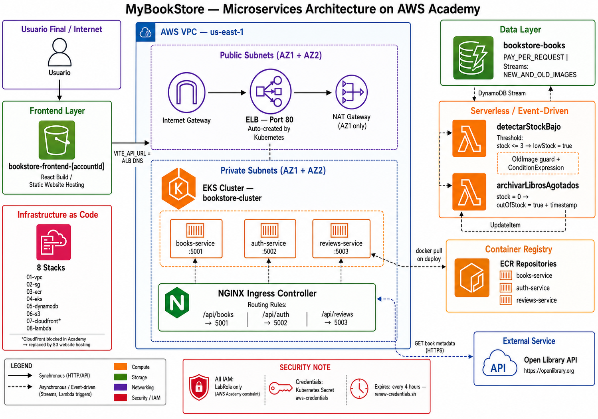

# Manual Técnico — MyBookStore
## Proyecto de Microservicios en AWS Academy

---

## Tabla de Contenidos

1. [Arquitectura General](#1-arquitectura-general)
2. [Infraestructura CloudFormation](#2-infraestructura-cloudformation)
   - 01 VPC
   - 02 Security Groups
   - 03 ECR
   - 04 EKS
   - 05 DynamoDB
   - 06 S3
   - 07 CloudFront
   - 08 Lambda
3. [Manifiestos Kubernetes](#3-manifiestos-kubernetes)
   - Deployments
   - Services
   - Ingress
   - Secret
4. [Código del Backend](#4-código-del-backend)
5. [Configuración del Frontend](#5-configuración-del-frontend)
6. [Flujo completo de despliegue](#6-flujo-completo-de-despliegue)

---

## 1. Arquitectura General

```
┌─────────────────────────────────────────────────────────┐
│                    USUARIO FINAL                         │
└────────────────────────┬────────────────────────────────┘
                         │
              ┌──────────▼──────────┐
              │   S3 Website        │  ← Frontend React
              │ (HTML/CSS/JS)       │
              └──────────┬──────────┘
                         │ VITE_API_URL = ALB
                         │
              ┌──────────▼──────────┐
              │   ELB (ALB clásico) │  ← Creado por Kubernetes
              │   Puerto 80         │
              └──────────┬──────────┘
                         │
              ┌──────────▼──────────┐
              │  NGINX Ingress      │  ← Enruta por path
              │  (dentro de EKS)    │
              └──────┬────┬────┬────┘
                     │    │    │
           /api/books│    │/api/auth   /api/reviews
                     │    │    │
         ┌───────────┘  ┌─┘  └──────────────┐
         │              │                    │
    ┌────▼────┐   ┌─────▼───┐   ┌───────────▼───┐
    │ books   │   │  auth   │   │   reviews     │
    │ service │   │ service │   │   service     │
    │ :5001   │   │ :5002   │   │   :5003       │
    └────┬────┘   └─────────┘   └───────────────┘
         │
    ┌────▼────────────┐        ┌──────────────────┐
    │   DynamoDB      │◄───────│ Lambda           │
    │ bookstore-books │ Stream │ detectarStockBajo │
    └─────────────────┘        └──────────────────┘
```



**Tecnologías usadas:**
- **Frontend**: React + Vite, alojado en S3 website hosting
- **Backend**: Node.js + Express, 3 microservicios
- **Orquestación**: Kubernetes en EKS
- **Base de datos**: DynamoDB (NoSQL)
- **Contenedores**: Docker → ECR (Elastic Container Registry)
- **Infraestructura**: CloudFormation (IaC)
- **Evento**: DynamoDB Streams + Lambda para `lowStock`

---

## 2. Infraestructura CloudFormation

Los templates se despliegan en orden numérico porque cada uno depende del anterior mediante `!ImportValue`.

### 📄 01-vpc.yaml — Red privada virtual

**¿Qué hace?** Crea toda la red de AWS donde vive el proyecto: subredes, rutas, y acceso a Internet.

```yaml
Parameters:
  VpcCidr:
    Default: "10.0.0.0/16"   # Rango de IPs del proyecto completo
  AZ1: us-east-1a             # Zona de disponibilidad 1
  AZ2: us-east-1b             # Zona de disponibilidad 2
```

**Recursos creados:**

```yaml
VPC:                          # La red privada principal
  CidrBlock: 10.0.0.0/16
  EnableDnsHostnames: true    # Los pods pueden resolver nombres DNS

InternetGateway:              # Puerta de salida a Internet
  # Sin esto, NADA tiene acceso a Internet

PublicSubnetAZ1/AZ2:          # Subredes con IP pública
  MapPublicIpOnLaunch: true   # EC2 aquí recibe IP pública automáticamente
  Tags:
    kubernetes.io/role/elb: "1"   # Le dice a K8s que puede crear ALBs aquí

PrivateSubnetAZ1/AZ2:         # Subredes sin IP pública
  MapPublicIpOnLaunch: false  # Los pods NO tienen IP pública directa
  Tags:
    kubernetes.io/role/internal-elb: "1"  # K8s sabe que son privadas

NatGateway:                   # Permite que pods privados salgan a Internet
  SubnetId: PublicSubnetAZ1   # Vive en la subred pública
  # NOTA: Solo 1 NAT (ahorro de créditos Academy ~$1/día)

S3VpcEndpoint:                # Tráfico S3 interno — NO pasa por NAT
  VpcEndpointType: Gateway    # Gratis y más rápido para S3/DynamoDB
```

**¿Por qué 2 tipos de subred?**
- **Pública**: El ALB (Load Balancer) vive aquí para recibir tráfico de Internet
- **Privada**: Los pods de Kubernetes viven aquí, protegidos de Internet directo

**Outputs exportados** (otros stacks los importan con `!ImportValue`):
```
bookstore-VpcId
bookstore-PublicSubnetAZ1Id / AZ2Id
bookstore-PrivateSubnetAZ1Id / AZ2Id
bookstore-PublicSubnetIds    (lista separada por comas)
bookstore-PrivateSubnetIds   (lista separada por comas)
```

---

### 📄 02-security-groups.yaml — Firewall de la aplicación

**¿Qué hace?** Define qué tráfico puede entrar y salir de cada componente.

```yaml
SGAlb:                        # Firewall del Load Balancer
  SecurityGroupIngress:
    - puerto 80  desde 0.0.0.0/0   # Cualquier persona puede hacer HTTP
    - puerto 443 desde 0.0.0.0/0   # Cualquier persona puede hacer HTTPS
  SecurityGroupEgress:
    - todo saliente permitido       # El ALB puede hablar con los pods

SGEks:                        # Firewall de los pods de Kubernetes
  SecurityGroupIngress:
    - puertos 5001-5003 desde SGAlb  # Solo el ALB puede llamar a los microservicios
    - puerto 80/443    desde SGAlb   # NGINX ingress controller
  SecurityGroupEgress:
    - todo saliente permitido        # Los pods pueden llamar a DynamoDB, APIs externas

SGEksIngressSelf:             # Regla especial — pods hablan entre sí
  Type: AWS::EC2::SecurityGroupIngress   # Recurso SEPARADO (evita error circular)
  IpProtocol: "-1"            # Todos los protocolos
  SourceSecurityGroupId: SGEks # El origen ES el mismo grupo
  # SIN esto los pods no pueden comunicarse entre ellos
```

**¿Por qué `SGEksIngressSelf` es un recurso separado?**

Si intentaras poner la regla "me permito a mí mismo" dentro del mismo `SGEks`, CloudFormation fallaría con error de dependencia circular: el SG necesita existir para referenciarse a sí mismo. La solución es crear primero el SG y luego agregar la regla en un recurso aparte.

**Outputs exportados:**
```
bookstore-SGAlbId
bookstore-SGEksId
```

---

### 📄 03-ecr.yaml — Repositorio de imágenes Docker

**¿Qué hace?** Crea los almacenes donde se guardan las imágenes Docker antes de desplegarlas en Kubernetes.

```yaml
ECRBooks:
  RepositoryName: bookstore-books-service
  ImageScanningConfiguration:
    ScanOnPush: true          # AWS escanea vulnerabilidades al hacer push
  LifecyclePolicy:
    rules:
      - Mantener las 5 imágenes más recientes
      # Las anteriores se borran automáticamente — ahorra espacio
```

**Flujo de uso:**
```
1. docker build → imagen local
2. docker tag   → le pones el nombre del repositorio ECR
3. docker push  → sube a ECR
4. Kubernetes   → descarga desde ECR al crear pods

URL del repositorio:
261273955683.dkr.ecr.us-east-1.amazonaws.com/bookstore-books-service:latest
└──────────┘  └──────────┘                  └───────────────────────┘ └─────┘
 Account ID    Región                         Nombre del repositorio    Tag
```

**Outputs exportados:**
```
bookstore-ECRBooksUri
bookstore-ECRAuthUri
bookstore-ECRReviewsUri
```

---

### 📄 04-eks.yaml — Cluster de Kubernetes

**¿Qué hace?** Crea el cluster Kubernetes donde corren todos los microservicios.

```yaml
Parameters:
  LabRoleArn:                 # ← CRÍTICO para AWS Academy
    # El LabRole es el único rol que Academy permite usar
    # Formato: arn:aws:iam::261273955683:role/LabRole

  KubernetesVersion: "1.30"  # Versión de K8s soportada en Academy 2025

  NodeInstanceType: t3.medium # Cada nodo tiene 2 vCPU y 4 GB RAM
  NodeDesiredSize: 2          # 2 nodos corriendo siempre
```

```yaml
EKSCluster:
  RoleArn: !Ref LabRoleArn        # LabRole controla el plano de control
  ResourcesVpcConfig:
    SubnetIds:                     # Subredes privadas para los pods
      - PrivateSubnetAZ1
      - PrivateSubnetAZ2
      - PublicSubnetAZ1            # Públicas para el ALB
      - PublicSubnetAZ2
    EndpointPublicAccess: true     # Permite kubectl desde tu laptop
    EndpointPrivateAccess: true    # Los pods también usan el endpoint interno
  Logging:
    EnabledTypes: [api, audit]     # Guarda logs para debugging

EKSNodeGroup:
  NodeRole: !Ref LabRoleArn        # LabRole controla los workers también
  AmiType: AL2023_x86_64_STANDARD  # Amazon Linux 2023 para los nodos
  ScalingConfig:
    MinSize: 2 / MaxSize: 4        # Auto-escala entre 2 y 4 nodos
  Subnets: [PrivateSubnetAZ1, AZ2] # Los nodos viven en subredes privadas
```

**¿Por qué LabRole para todo?**

AWS Academy bloquea la creación de nuevos IAM Roles. LabRole ya existe con los permisos necesarios y puede ser asumido tanto por el plano de control de EKS como por los nodos EC2.

**Outputs exportados:**
```
bookstore-ClusterName
bookstore-ClusterEndpoint
bookstore-ClusterArn
```

---

### 📄 05-dynamodb.yaml — Base de datos

**¿Qué hace?** Crea la tabla NoSQL donde se almacenan los libros.

```yaml
BooksTable:
  TableName: bookstore-books
  BillingMode: PAY_PER_REQUEST    # Sin costo fijo — pagas por consulta
                                   # Ideal para Academy (costo ~$0)

  AttributeDefinitions:
    - AttributeName: id
      AttributeType: S             # S = String (no Number ni Binary)

  KeySchema:
    - AttributeName: id
      KeyType: HASH                # Clave primaria de la tabla

  StreamSpecification:
    StreamViewType: NEW_AND_OLD_IMAGES
    # Cuando un item se modifica, el Stream captura:
    #   - NewImage: cómo quedó después del cambio
    #   - OldImage: cómo estaba antes del cambio
    # Esto permite que Lambda compare y detecte cambios en stock
```

**Estructura de un ítem en DynamoDB:**
```json
{
  "id":           { "S": "1" },
  "name":         { "S": "Cien años de soledad" },
  "author":       { "S": "Gabriel García Márquez" },
  "price":        { "S": "$25.000" },
  "countInStock": { "N": "10" },
  "lowStock":     { "BOOL": false },
  "image":        { "S": "https://..." }
}
```

**¿Qué es `PointInTimeRecovery`?**
Permite restaurar la tabla a cualquier momento de las últimas 35 días. Es como un backup automático continuo.

**Outputs exportados:**
```
bookstore-BooksTableName      → "bookstore-books"
bookstore-BooksTableArn       → ARN para permisos IAM
bookstore-BooksTableStreamArn → ARN del stream para conectar Lambda
```

---

### 📄 06-s3.yaml — Almacenamiento de archivos

**¿Qué hace?** Crea dos buckets S3: uno para el frontend React y otro para imágenes de portadas.

```yaml
ObjectsBucket:
  BucketName: bookstore-objects-261273955683
  # El AccountId en el nombre garantiza que sea único globalmente
  PublicAccessBlockConfiguration:
    BlockPublicAcls: true          # Nadie puede hacer público via ACL
    BlockPublicPolicy: true        # Nadie puede hacer público via Policy
    RestrictPublicBuckets: true    # Bloqueo completo
  CorsConfiguration:
    AllowedMethods: [GET]          # Solo lectura para portadas

FrontendBucket:
  BucketName: bookstore-frontend-261273955683
  PublicAccessBlockConfiguration:
    BlockPublicAcls: true          # Inicia privado
    # deploy-all.sh lo abre después para S3 website hosting
```

**Nota:** El bucket frontend empieza privado. El `deploy-all.sh` lo abre con:
```bash
aws s3api put-public-access-block \
  --public-access-block-configuration "BlockPublicAcls=false,..."
aws s3 website s3://bookstore-frontend-261273955683 \
  --index-document index.html --error-document index.html
```

**Outputs exportados:**
```
bookstore-FrontendBucketName / Arn
bookstore-ObjectsBucketName / Arn
```

---

### 📄 07-cloudfront.yaml — CDN (referencia — bloqueado en Academy)

**¿Qué hace?** Define una distribución CDN que sirve el frontend desde S3 y enruta `/api/*` al ALB.

> ⚠️ **En AWS Academy `cloudfront:CreateDistribution` está bloqueado.** Este template se mantiene para referencia y para entornos con permisos completos. En Academy se usa S3 website hosting directamente.

```yaml
Origins:
  # Origin 1: S3 sirve los archivos React
  - Id: S3FrontendOrigin
    DomainName: bookstore-frontend-261273955683.s3.us-east-1.amazonaws.com
    S3OriginConfig:
      OriginAccessIdentity: ""    # Sin OAC (también bloqueado en Academy)

  # Origin 2: ALB sirve las APIs
  - Id: ALBOrigin
    DomainName: <dns-del-alb>.elb.amazonaws.com
    CustomOriginConfig:
      OriginProtocolPolicy: http-only   # ALB escucha en HTTP puerto 80

CacheBehaviors:
  - PathPattern: "/api/*"
    TargetOriginId: ALBOrigin
    CachePolicyId: 4135ea2d-...         # CachingDisabled — las APIs no se cachean
    AllowedMethods: [GET,HEAD,OPTIONS,PUT,POST,PATCH,DELETE]

DefaultCacheBehavior:
  TargetOriginId: S3FrontendOrigin
  CachePolicyId: 658327ea-...           # CachingOptimized — los assets se cachean

CustomErrorResponses:
  - ErrorCode: 403 → 200, /index.html  # React Router: 403 → index.html
  - ErrorCode: 404 → 200, /index.html  # React Router: 404 → index.html
  # Sin esto, al refrescar /book/123 en el browser daría error real
```

---

### 📄 08-lambda.yaml — Funciones serverless

**¿Qué hace?** Dos Lambdas que reaccionan automáticamente a cambios en DynamoDB.

#### Lambda 1: `detectarStockBajo`

```yaml
LambdaDetectarStockBajo:
  Runtime: nodejs20.x
  Role: arn:aws:iam::261273955683:role/LabRole   # Sin crear IAM Role propio
  Timeout: 15                # Máximo 15 segundos de ejecución
  MemorySize: 128            # Mínima memoria necesaria

  Environment:
    DYNAMO_TABLE: bookstore-books
    STOCK_THRESHOLD: 3       # lowStock = true cuando stock <= 3
```

**Lógica del código (inline en el YAML):**
```javascript
exports.handler = async (event) => {
  for (const record of event.Records) {

    // Solo procesar modificaciones (no INSERT ni DELETE)
    if (record.eventName !== "MODIFY") continue;

    const bookId   = record.dynamodb.NewImage.id.S;
    const stock    = parseInt(record.dynamodb.NewImage.countInStock.N);
    const lowStock = stock > 0 && stock <= THRESHOLD;  // true si 1,2 o 3

    // ── GUARD ANTI-LOOP ──────────────────────────────────────
    // Si lowStock no cambió respecto a antes, NO actualizar
    // Sin esto: actualizar lowStock → dispara Stream → Lambda
    // → actualiza lowStock → dispara Stream → Lambda... infinito
    const oldLowStock = record.dynamodb.OldImage?.lowStock?.BOOL ?? null;
    if (oldLowStock === lowStock) continue;   // ya tenía ese valor, skip

    // Actualizar en DynamoDB
    await dynamo.send(new UpdateItemCommand({
      UpdateExpression: "SET lowStock = :val",
      // Segunda capa anti-loop: condición en DynamoDB
      // Si ya tiene ese valor, la operación no hace nada
      ConditionExpression: "attribute_not_exists(lowStock) OR lowStock <> :val"
    }));
  }
};
```

**Tres capas de protección contra loop infinito:**

| Capa | Dónde | Cómo |
|------|-------|------|
| 1 | FilterCriteria | Solo llegan eventos MODIFY (no INSERT) |
| 2 | Código JS | Compara OldImage vs valor calculado — skip si igual |
| 3 | DynamoDB ConditionExpression | La DB rechaza la escritura si ya tiene el valor |

#### Lambda 2: `archivarLibrosAgotados`

```javascript
// Se activa cuando countInStock cambia a 0
if (stock === 0) {
  // Marca el libro como agotado con fecha
  SET outOfStock = true
  SET outOfStockSince = "2025-05-29T00:00:00.000Z"
} else if (wasOutOfStock) {
  // Si se reabastece, limpia los campos
  SET outOfStock = false
  REMOVE outOfStockSince
}
```

**El trigger — cómo se conecta DynamoDB con Lambda:**
```yaml
TriggerStockBajo:
  Type: AWS::Lambda::EventSourceMapping
  EventSourceArn: bookstore-BooksTableStreamArn  # El stream de la tabla
  StartingPosition: LATEST                       # Solo eventos nuevos
  BatchSize: 10                                  # Procesa hasta 10 cambios juntos
  BisectBatchOnFunctionError: true               # Si falla, divide el lote a la mitad
  FilterCriteria:
    Filters:
      - Pattern: '{"eventName": ["MODIFY"]}'    # Solo MODIFY llega a Lambda
```

---

## 3. Manifiestos Kubernetes

Los manifiestos están en la carpeta `k8s/` y definen cómo corren los microservicios dentro del cluster EKS.

### 📄 Deployment (ejemplo: books-deployment.yaml)

**¿Qué hace?** Le dice a Kubernetes cómo crear y mantener corriendo los pods del servicio.

```yaml
apiVersion: apps/v1
kind: Deployment
metadata:
  name: books-deployment       # Nombre del deployment

spec:
  replicas: 2                  # Siempre 2 copias del pod corriendo
                               # Si uno falla, el otro sigue sirviendo

  selector:
    matchLabels:
      app: books-service       # Este deployment controla pods con este label

  template:                    # Plantilla de cada pod
    metadata:
      labels:
        app: books-service     # Label que deben tener los pods

    spec:
      containers:
        - name: books-service
          # Imagen desde ECR — se actualiza con cada docker push
          image: 261273955683.dkr.ecr.us-east-1.amazonaws.com/bookstore-books-service:latest
          ports:
            - containerPort: 5001    # Puerto que expone el pod internamente

          env:
            - name: PORT
              value: "5001"          # Variable de entorno directa

            # Variables que vienen del Secret aws-credentials
            # El pod NO tiene las credenciales en texto plano en el YAML
            - name: AWS_ACCESS_KEY_ID
              valueFrom:
                secretKeyRef:
                  name: aws-credentials    # Nombre del Secret en K8s
                  key: AWS_ACCESS_KEY_ID   # Clave dentro del Secret

            - name: AWS_SECRET_ACCESS_KEY
              valueFrom:
                secretKeyRef:
                  name: aws-credentials
                  key: AWS_SECRET_ACCESS_KEY

            - name: AWS_SESSION_TOKEN
              valueFrom:
                secretKeyRef:
                  name: aws-credentials
                  key: AWS_SESSION_TOKEN

            - name: DYNAMO_TABLE
              valueFrom:
                secretKeyRef:
                  name: aws-credentials
                  key: DYNAMO_TABLE        # "bookstore-books"
```

**¿Por qué `replicas: 2`?**

Alta disponibilidad. Kubernetes los distribuye en diferentes nodos EC2 (AZ1 y AZ2). Si el nodo de AZ1 falla, el pod de AZ2 sigue respondiendo sin interrupción.

**¿Por qué `secretKeyRef` en lugar de poner las credenciales directas?**

Seguridad. Si pusieras `value: "ASIATZVJEFVR..."` en el YAML, las credenciales quedarían en texto plano en Git. Con `secretKeyRef`, el Secret se crea por separado (y no se commitea).

---

### 📄 Service (ejemplo: books-service.yaml)

**¿Qué hace?** Crea una IP virtual estable que balancea el tráfico entre los pods.

```yaml
apiVersion: v1
kind: Service
metadata:
  name: books-service          # Nombre DNS interno: books-service.default.svc.cluster.local

spec:
  type: ClusterIP              # Solo accesible dentro del cluster
                               # (no expuesto a Internet directamente)

  selector:
    app: books-service         # Balancea hacia pods con este label
                               # Automáticamente incluye/excluye pods según su estado

  ports:
    - protocol: TCP
      port: 5001               # Puerto que escucha el Service
      targetPort: 5001         # Puerto del contenedor al que redirige
```

**Tipos de Service en Kubernetes:**

| Tipo | ¿Accesible desde? | Uso |
|------|------------------|-----|
| `ClusterIP` | Solo dentro del cluster | Microservicio interno |
| `NodePort` | Desde fuera del nodo | Dev/testing |
| `LoadBalancer` | Internet | Crear ALB automáticamente |

Los microservicios usan `ClusterIP` porque solo el Ingress (NGINX) necesita accederlos.

---

### 📄 ingress.yaml — Enrutador de tráfico

**¿Qué hace?** Define las reglas de enrutamiento: qué path va a qué servicio.

```yaml
apiVersion: networking.k8s.io/v1
kind: Ingress
metadata:
  name: bookstore-ingress
  # SIN annotations rewrite-target — eso causaba el bug donde
  # /api/books llegaba como / al backend y devolvía el health check

spec:
  ingressClassName: nginx       # Usa el NGINX Ingress Controller instalado en EKS

  rules:
    - http:
        paths:
          - path: /api/books
            pathType: Prefix    # Prefix = /api/books Y /api/books/123 coinciden
            backend:
              service:
                name: books-service   # Nombre del Service K8s
                port:
                  number: 5001

          - path: /api/auth
            pathType: Prefix
            backend:
              service:
                name: auth-service
                port:
                  number: 5002

          - path: /api/reviews
            pathType: Prefix
            backend:
              service:
                name: reviews-service
                port:
                  number: 5003
```

**¿Qué hace NGINX Ingress Controller?**

Es un pod especial dentro del cluster que actúa como reverse proxy. Lee los recursos `Ingress` y configura automáticamente las reglas de enrutamiento. Cuando se crea, Kubernetes automáticamente crea un ELB/ALB real en AWS.

**El error que se tuvo y se resolvió:**
```yaml
# ❌ INCORRECTO — causaba el bug
annotations:
  nginx.ingress.kubernetes.io/rewrite-target: /
# Este annotation reescribía /api/books → /
# El backend recibía / y respondía {"status":"Ok"} en lugar de los libros

# ✅ CORRECTO — sin rewrite
# El path /api/books llega intacto al backend
# El backend tiene: app.use("/api/books", bookRoutes) que lo maneja correctamente
```

---

### 📄 dynamo-secret.yaml — Configuración heredada

```yaml
apiVersion: v1
kind: Secret
metadata:
  name: dynamo-secret
type: Opaque
data:
  dynamo-table: Ym9va3N0b3JlLWJvb2tz  # base64 de "bookstore-books"
```

> ⚠️ **Nota:** Este secret es de la versión anterior del proyecto (antes de migrar a DynamoDB completo). Ahora el deployment usa `aws-credentials` como secret principal que incluye `DYNAMO_TABLE`. Este archivo puede ignorarse pero no causa daño.

---

## 4. Código del Backend

### 📄 server.js — Punto de entrada

```javascript
import express from "express";
import cors from "cors";

const app = express();

app.use(cors());              // Permite llamadas desde cualquier origen
                              // Necesario porque S3 y ALB son dominios distintos

app.use(express.json());      // Parsea automáticamente el body JSON

// Health check — responde en GET /
app.get("/", (req, res) => {
  res.json({ status: "Ok", service: "books-service" });
  // Kubernetes usa esto para saber si el pod está vivo (liveness probe)
});

app.use("/api/books", bookRoutes);  // Todas las rutas de libros

// Middleware de errores — captura cualquier error no manejado
app.use((err, req, res, next) => {
  res.status(err.status || 500).json({ message: err.message });
});

app.listen(PORT, () => {
  console.log(`books-service running on port ${PORT}`);
  console.log(`DynamoDB table: ${process.env.DYNAMO_TABLE}`);
});
```

### 📄 config/dynamo.js — Conexión DynamoDB

```javascript
const environment = process.env.NODE_ENV || "development";

let clientConfig = { region };

if (environment === "production") {
  // En EKS: las credenciales vienen del Secret de Kubernetes
  // (AWS_ACCESS_KEY_ID, AWS_SECRET_ACCESS_KEY, AWS_SESSION_TOKEN)
  // El SDK las lee automáticamente de las variables de entorno
  console.log("DynamoDB: modo production (IAM Role)");

} else {
  // En desarrollo local: apunta a DynamoDB Local (Docker)
  clientConfig.endpoint    = "http://localhost:8000";
  clientConfig.credentials = fromEnv();   // Lee del .env local
}

const client    = new DynamoDBClient(clientConfig);
const docClient = DynamoDBDocumentClient.from(client);
// DynamoDBDocumentClient simplifica el formato:
// Sin él:  { "N": "10" }
// Con él:  10  (JavaScript nativo)

export default docClient;
```

### 📄 Dockerfile

```dockerfile
FROM node:20-alpine AS base
# Alpine = versión mínima de Linux (~5MB vs ~200MB de Ubuntu)
# Imagen más pequeña = deploy más rápido, menos costo de almacenamiento

WORKDIR /usr/src/app

COPY package*.json ./

RUN npm ci --omit=dev
# npm ci = instalación limpia y reproducible (mejor que npm install para producción)
# --omit=dev = no instala devDependencies (nodemon, etc.) → imagen más pequeña

COPY . .

EXPOSE 5001           # Documenta el puerto (no lo abre realmente)

CMD ["npm", "start"]  # Comando que se ejecuta al iniciar el contenedor
```

---

## 5. Configuración del Frontend

### 📄 vite.config.js — Proxy para desarrollo local

```javascript
export default defineConfig({
  base: '/',
  plugins: [react()],
  server: {
    port: 3000,
    proxy: {
      // Cuando en desarrollo haces fetch('/api/books'),
      // Vite redirige la llamada a localhost:5001
      // Así evitas errores CORS en desarrollo
      '/api/books': {
        target: 'http://localhost:5001',
        changeOrigin: true,   // Cambia el header Host al del target
      },
      '/api/auth': {
        target: 'http://localhost:5002',
      },
      '/api/reviews': {
        target: 'http://localhost:5003',
      },
    }
  }
})
```

**¿Por qué esto solo funciona en dev?**

El proxy de Vite solo existe cuando corres `npm run dev`. En producción (`npm run build`), los archivos son HTML/CSS/JS estáticos sin servidor Node. Las llamadas `/api/*` van directamente al ALB.

### Variable de entorno VITE_API_URL

```bash
# Desarrollo local: vacío (usa proxy de Vite)
VITE_API_URL=""

# Producción en AWS: URL del ALB
VITE_API_URL="http://a049610ad...elb.amazonaws.com"
```

En el código React:
```javascript
// lib/api.js
export const api = axios.create({
  baseURL: import.meta.env.VITE_API_URL || "",
  // Si VITE_API_URL está vacío → usa rutas relativas (/api/books)
  // Si tiene valor → usa URL absoluta (http://alb.../api/books)
});
```

---

## 6. Flujo completo de despliegue

```
deploy-all.sh
│
├── 1. Verificar credenciales AWS activas
│
├── 2. CloudFormation — Infraestructura base
│   ├── 01-vpc.yaml           → VPC, subredes, NAT, rutas
│   ├── 02-security-groups    → Firewalls ALB y EKS
│   └── 03-ecr.yaml           → Repositorios Docker
│
├── 3. Docker build + push
│   ├── books-service   → ECR
│   ├── auth-service    → ECR
│   └── reviews-service → ECR
│
├── 4. CloudFormation — EKS (15-25 min)
│   └── 04-eks.yaml     → Cluster K8s + Node Group
│
├── 5. kubectl configurar
│   └── aws eks update-kubeconfig
│
├── 6. CloudFormation — Datos y almacenamiento
│   ├── 05-dynamodb.yaml → Tabla books + Streams
│   └── 06-s3.yaml       → Buckets frontend y objetos
│
├── 7. Seed DynamoDB
│   └── aws dynamodb put-item × 6 libros
│
├── 8. S3 Website Hosting
│   ├── Deshabilitar block public access
│   ├── Agregar bucket policy pública
│   └── aws s3 website --index-document index.html
│
├── 9. Kubernetes — Secret de credenciales
│   └── kubectl create secret generic aws-credentials
│       (AWS_ACCESS_KEY_ID, AWS_SECRET_ACCESS_KEY, AWS_SESSION_TOKEN, ...)
│
├── 10. Kubernetes — Microservicios
│    ├── kubectl apply books-service/
│    ├── kubectl apply auth-service/
│    ├── kubectl apply reviews-service/
│    └── kubectl apply ingress.yaml
│        → NGINX crea ELB automáticamente
│
├── 11. Frontend build y sync
│    ├── VITE_API_URL=http://<ALB> npm run build
│    └── aws s3 sync dist/ s3://bookstore-frontend-...
│
└── 12. CloudFormation — Lambda
    └── 08-lambda.yaml → detectarStockBajo + archivarLibrosAgotados

URL final: http://bookstore-frontend-261273955683.s3-website-us-east-1.amazonaws.com
```

---

## Notas importantes para AWS Academy

| Restricción | Impacto | Solución aplicada |
|---|---|---|
| No se puede crear IAM Roles | Lambdas y EKS no pueden tener roles propios | Todos usan `LabRole` directamente |
| `cloudfront:CreateDistribution` bloqueado | No se puede crear distribución CDN | S3 website hosting en su lugar |
| `cloudfront:CreateOriginAccessControl` bloqueado | No se puede proteger el bucket con OAC | Bucket público con policy abierta |
| Credenciales expiran cada 4 horas | Los pods pierden acceso a DynamoDB | Script de renovación en `renew-credentials.sh` |
| Solo 1 NAT Gateway | Si AZ1 falla, AZ2 pierde salida | Aceptado: entorno académico, no producción |

